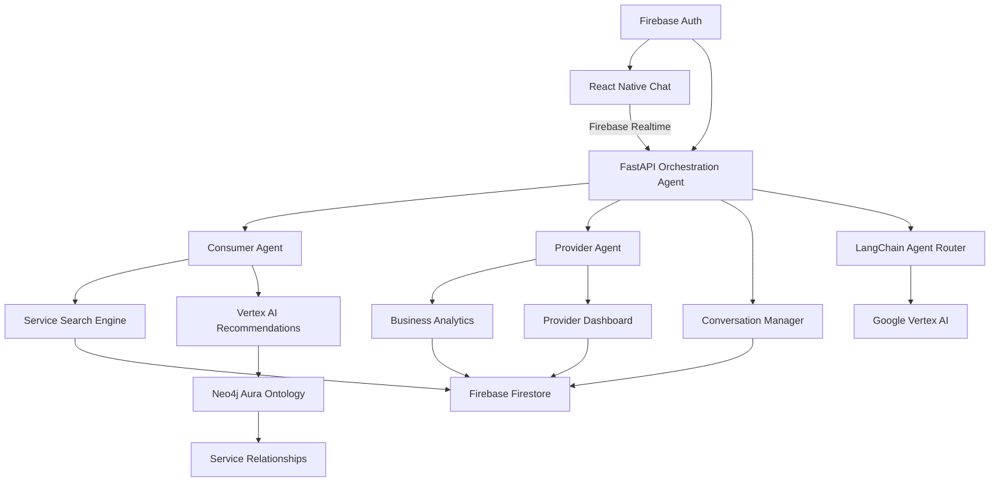

# 🤖 AI Agent Orchestration System - Implementation Guide

## 📋 **Project Overview**

Building a multi-agent AI system for Kumbuk with:

- **1 Orchestration Agent** (Main router and conversation manager)
- **2 Specialized Agents** (Consumer Agent + Provider Agent)
- **React Native Chat Interface** (Frontend with real-time messaging)
- **FastAPI Backend** (Agent orchestration and API management)

### 🛠️ **Technology Stack**

- **🔥 Firebase Ecosystem**: Authentication, Firestore NoSQL database, Realtime Database
- **🤖 AI/ML**: Google Vertex AI for advanced AI capabilities, LangChain for LLM orchestration
- **🕸️ Knowledge Graph**: Neo4j Aura for ontology and relationship mapping
- **⚡ Backend**: FastAPI with Python for high-performance API
- **📱 Frontend**: React Native with Expo for cross-platform mobile development
- **🔄 Real-time**: Firebase Realtime Database for instant messaging and live updates

---

## 🏗️ **System Architecture**



---

## 🎯 **Agent Specifications**

### 🎪 **1. Orchestration Agent**

```python
# Role: Main traffic controller and conversation manager
class OrchestrationAgent:
    responsibilities = [
        "Route user queries to appropriate specialist agent",
        "Manage conversation context and history",
        "Combine responses from multiple agents",
        "Handle authentication and user sessions",
        "Monitor agent performance and health"
    ]

    capabilities = [
        "Intent classification (consumer vs provider queries)",
        "Context switching between agents",
        "Response aggregation and formatting",
        "Session management and persistence",
        "Error handling and fallback responses"
    ]
```

### 🛍️ **2. Consumer Agent**

```python
# Role: Service finder and consumer assistant
class ConsumerAgent:
    responsibilities = [
        "Help consumers find local services",
        "Search and filter service providers",
        "Create and manage service inquiries",
        "Provide personalized recommendations",
        "Compare prices and provider ratings"
    ]

    capabilities = [
        "Natural language service search",
        "Location-based provider filtering",
        "Price comparison and analysis",
        "Review and rating interpretation",
        "Inquiry generation and tracking"
    ]

    example_queries = [
        "Find me a plumber near Colombo under Rs. 5000",
        "Which electrician has the best reviews in Kandy?",
        "I need a caterer for 50 people this weekend",
        "Compare prices for house cleaning services"
    ]
```

### 🏪 **3. Provider Agent**

```python
# Role: Business assistant for service providers
class ProviderAgent:
    responsibilities = [
        "Help providers manage their business",
        "Analyze business performance metrics",
        "Manage service listings and pricing",
        "Handle customer inquiries and responses",
        "Provide market insights and recommendations"
    ]

    capabilities = [
        "Business analytics and reporting",
        "Service optimization suggestions",
        "Customer inquiry management",
        "Market trend analysis",
        "Pricing strategy recommendations"
    ]

    example_queries = [
        "How is my business performing this month?",
        "What services are in high demand in my area?",
        "Help me respond to this customer inquiry",
        "Should I increase my prices for wedding photography?"
    ]
```

---

## 💻 **Implementation Roadmap**

### 🔧 **Phase 1: Backend Foundation**

#### 1.1 Create FastAPI Orchestration Backend

```python
# File: backend/app/agents/orchestrator.py
from fastapi import FastAPI, WebSocket
from typing import Dict, List
import json
from datetime import datetime

class OrchestrationAgent:
    def __init__(self):
        self.consumer_agent = ConsumerAgent()
        self.provider_agent = ProviderAgent()
        self.conversation_history = {}

    async def process_message(self, user_id: str, message: str) -> Dict:
        # 1. Classify intent (consumer vs provider query)
        intent = await self.classify_intent(message, user_id)

        # 2. Route to appropriate agent
        if intent == "consumer":
            response = await self.consumer_agent.handle_query(message, user_id)
        elif intent == "provider":
            response = await self.provider_agent.handle_query(message, user_id)
        else:
            response = await self.handle_general_query(message, user_id)

        # 3. Save conversation history
        await self.save_conversation(user_id, message, response)

        return response
```

#### 1.2 Set up WebSocket for Real-time Chat

```python
# File: backend/app/api/routes/chat.py
from fastapi import WebSocket, WebSocketDisconnect
from app.agents.orchestrator import OrchestrationAgent

orchestrator = OrchestrationAgent()

@app.websocket("/ws/chat/{user_id}")
async def chat_websocket(websocket: WebSocket, user_id: str):
    await websocket.accept()

    try:
        while True:
            # Receive message from React Native
            data = await websocket.receive_text()
            message_data = json.loads(data)

            # Process with orchestration agent
            response = await orchestrator.process_message(
                user_id,
                message_data["message"]
            )

            # Send response back to React Native
            await websocket.send_text(json.dumps(response))

    except WebSocketDisconnect:
        print(f"Client {user_id} disconnected")
```

### 📱 **Phase 2: React Native Chat Interface**

#### 2.1 Create Chat Component

```typescript
// File: apps/consumer-app/src/components/AgentChat.tsx
import React, { useState, useEffect } from 'react';
import {
  View,
  Text,
  TextInput,
  ScrollView,
  TouchableOpacity,
} from 'react-native';

interface Message {
  id: string;
  text: string;
  sender: 'user' | 'agent';
  timestamp: Date;
  agentType?: 'consumer' | 'provider' | 'orchestrator';
}

export const AgentChat: React.FC = () => {
  const [messages, setMessages] = useState<Message[]>([]);
  const [inputText, setInputText] = useState('');
  const [ws, setWs] = useState<WebSocket | null>(null);
  const [isConnected, setIsConnected] = useState(false);

  useEffect(() => {
    // Connect to FastAPI WebSocket
    const websocket = new WebSocket('ws://localhost:8000/ws/chat/user123');

    websocket.onopen = () => {
      setIsConnected(true);
      setWs(websocket);
    };

    websocket.onmessage = (event) => {
      const response = JSON.parse(event.data);
      addMessage(response.text, 'agent', response.agentType);
    };

    return () => websocket.close();
  }, []);

  const sendMessage = () => {
    if (inputText.trim() && ws) {
      // Add user message to UI
      addMessage(inputText, 'user');

      // Send to FastAPI orchestrator
      ws.send(JSON.stringify({ message: inputText }));

      setInputText('');
    }
  };

  const addMessage = (
    text: string,
    sender: 'user' | 'agent',
    agentType?: string
  ) => {
    const newMessage: Message = {
      id: Date.now().toString(),
      text,
      sender,
      timestamp: new Date(),
      agentType,
    };
    setMessages((prev) => [...prev, newMessage]);
  };

  return (
    <View style={{ flex: 1, padding: 16 }}>
      {/* Chat Messages */}
      <ScrollView style={{ flex: 1 }}>
        {messages.map((msg) => (
          <View
            key={msg.id}
            style={{
              alignSelf: msg.sender === 'user' ? 'flex-end' : 'flex-start',
              backgroundColor: msg.sender === 'user' ? '#007AFF' : '#E5E5EA',
              padding: 12,
              borderRadius: 18,
              marginVertical: 4,
              maxWidth: '80%',
            }}
          >
            <Text
              style={{
                color: msg.sender === 'user' ? 'white' : 'black',
              }}
            >
              {msg.text}
            </Text>
            {msg.agentType && (
              <Text
                style={{
                  fontSize: 10,
                  opacity: 0.7,
                  color: msg.sender === 'user' ? 'white' : 'black',
                }}
              >
                via {msg.agentType} agent
              </Text>
            )}
          </View>
        ))}
      </ScrollView>

      {/* Input Section */}
      <View
        style={{
          flexDirection: 'row',
          alignItems: 'center',
          paddingTop: 12,
          borderTopWidth: 1,
          borderTopColor: '#E5E5EA',
        }}
      >
        <TextInput
          value={inputText}
          onChangeText={setInputText}
          placeholder="Ask me anything about services..."
          style={{
            flex: 1,
            borderWidth: 1,
            borderColor: '#E5E5EA',
            borderRadius: 20,
            paddingHorizontal: 16,
            paddingVertical: 8,
            marginRight: 12,
          }}
          multiline
          onSubmitEditing={sendMessage}
        />
        <TouchableOpacity
          onPress={sendMessage}
          style={{
            backgroundColor: isConnected ? '#007AFF' : '#CCC',
            borderRadius: 20,
            paddingHorizontal: 16,
            paddingVertical: 8,
          }}
          disabled={!isConnected}
        >
          <Text style={{ color: 'white', fontWeight: 'bold' }}>Send</Text>
        </TouchableOpacity>
      </View>
    </View>
  );
};
```

### 🤖 **Phase 3: AI Integration**

#### 3.1 Connect to Vertex AI with LangChain

```python
# File: backend/app/services/ai_service.py
from langchain.chat_models import ChatVertexAI
from langchain.schema import HumanMessage, SystemMessage
from langchain.chains import ConversationChain
from langchain.memory import ConversationBufferWindowMemory
from google.cloud import aiplatform
from typing import Dict, List
import os

class AIService:
    def __init__(self):
        # Initialize Google Cloud AI Platform
        aiplatform.init(
            project=os.getenv("GOOGLE_CLOUD_PROJECT"),
            location=os.getenv("GOOGLE_CLOUD_REGION", "us-central1")
        )

        # Initialize Vertex AI LLM with LangChain
        self.llm = ChatVertexAI(
            model_name="chat-bison@001",  # Or gemini-pro
            temperature=0.7,
            max_output_tokens=500,
            top_p=0.8
        )

        # Memory for conversation context
        self.memory = ConversationBufferWindowMemory(
            k=10,  # Remember last 10 exchanges
            return_messages=True
        )

    async def generate_response(
        self,
        prompt: str,
        context: Dict,
        agent_type: str,
        user_id: str
    ) -> str:

        # System prompts for different agents
        system_prompts = {
            "consumer": """You are KumbuK's Consumer Agent, an AI assistant for consumers looking for local services in Sri Lanka.
                          Use the Neo4j ontology data to provide accurate service recommendations based on location, category, and user preferences.
                          Help them find service providers, compare options, and make smart booking decisions.""",

            "provider": """You are KumbuK's Provider Agent, an AI business assistant for service providers in Sri Lanka.
                          Analyze Firebase Firestore business data to help them manage services, understand performance metrics,
                          and grow their customer base with data-driven insights.""",

            "orchestrator": """You are KumbuK's Orchestration Agent. Route user queries intelligently to Consumer or Provider agents.
                              Manage conversation flow and provide seamless user experience across the platform."""
        }

        # Create conversation chain with agent-specific memory
        conversation = ConversationChain(
            llm=self.llm,
            memory=self.get_user_memory(user_id, agent_type),
            verbose=True
        )

        # Prepare system message
        system_message = SystemMessage(content=system_prompts[agent_type])

        # Add context from Neo4j ontology if available
        if context.get("neo4j_context"):
            enhanced_prompt = f"""
            Context from Knowledge Graph: {context['neo4j_context']}

            User Query: {prompt}
            """
        else:
            enhanced_prompt = prompt

        # Generate response using LangChain
        response = await conversation.apredict(input=enhanced_prompt)

        return response

    def get_user_memory(self, user_id: str, agent_type: str):
        """Get or create conversation memory for specific user and agent"""
        memory_key = f"{user_id}_{agent_type}"
        if memory_key not in self.user_memories:
            self.user_memories[memory_key] = ConversationBufferWindowMemory(
                k=10,
                return_messages=True
            )
        return self.user_memories[memory_key]
```

```python
# File: backend/app/services/ai_service.py
from openai import AsyncOpenAI
from typing import Dict, List
import os

class AIService:
    def __init__(self):
        self.client = AsyncOpenAI(
            api_key=os.getenv("OPENAI_API_KEY")
        )

    async def generate_response(
        self,
        prompt: str,
        context: Dict,
        agent_type: str
    ) -> str:

        # System prompts for different agents
        system_prompts = {
            "consumer": """You are a helpful assistant for consumers looking for local services in Sri Lanka.
                          Help them find service providers, compare options, and make bookings.""",

            "provider": """You are a business assistant for service providers in Sri Lanka.
                          Help them manage their business, analyze performance, and grow their customer base.""",

            "orchestrator": """You are the main orchestrator agent. Route queries to appropriate
                              specialists and provide general assistance."""
        }

        messages = [
            {"role": "system", "content": system_prompts[agent_type]},
            {"role": "user", "content": prompt}
        ]

        # Add conversation context if available
        if context.get("conversation_history"):
            for msg in context["conversation_history"][-5:]:  # Last 5 messages
                messages.insert(-1, msg)

        response = await self.client.chat.completions.create(
            model="gpt-4-turbo-preview",
            messages=messages,
            max_tokens=500,
            temperature=0.7
        )

        return response.choices[0].message.content
```

#### 3.2 Neo4j Ontology Service

```python
# File: backend/app/services/neo4j_service.py
from neo4j import AsyncGraphDatabase
from typing import Dict, List, Optional
import os

class Neo4jOntologyService:
    def __init__(self):
        self.driver = AsyncGraphDatabase.driver(
            os.getenv("NEO4J_URI"),
            auth=(os.getenv("NEO4J_USER"), os.getenv("NEO4J_PASSWORD"))
        )

    async def get_service_relationships(self, service_category: str) -> Dict:
        """Get related services and providers from knowledge graph"""
        async with self.driver.session() as session:
            query = """
            MATCH (s:Service {category: $category})-[:RELATED_TO]-(rs:Service)
            MATCH (s)-[:PROVIDED_BY]-(p:Provider)
            MATCH (p)-[:LOCATED_IN]-(l:Location)
            RETURN s, rs, p, l
            LIMIT 20
            """
            result = await session.run(query, category=service_category)

            relationships = []
            async for record in result:
                relationships.append({
                    "service": record["s"],
                    "related_services": record["rs"],
                    "provider": record["p"],
                    "location": record["l"]
                })

            return {"relationships": relationships}

    async def find_similar_providers(self, provider_id: str) -> List[Dict]:
        """Find similar providers based on graph relationships"""
        async with self.driver.session() as session:
            query = """
            MATCH (p1:Provider {id: $provider_id})-[:OFFERS]->(s:Service)
            MATCH (p2:Provider)-[:OFFERS]->(s)
            WHERE p1 <> p2
            MATCH (p2)-[:LOCATED_IN]->(l:Location)
            RETURN p2, l, COUNT(s) as similarity_score
            ORDER BY similarity_score DESC
            LIMIT 10
            """
            result = await session.run(query, provider_id=provider_id)

            similar_providers = []
            async for record in result:
                similar_providers.append({
                    "provider": record["p2"],
                    "location": record["l"],
                    "similarity_score": record["similarity_score"]
                })

            return similar_providers

    async def get_location_insights(self, location: str) -> Dict:
        """Get market insights for a specific location"""
        async with self.driver.session() as session:
            query = """
            MATCH (l:Location {name: $location})<-[:LOCATED_IN]-(p:Provider)
            MATCH (p)-[:OFFERS]->(s:Service)
            RETURN s.category as service_category,
                   COUNT(p) as provider_count,
                   AVG(p.rating) as avg_rating,
                   AVG(p.price) as avg_price
            ORDER BY provider_count DESC
            """
            result = await session.run(query, location=location)

            insights = []
            async for record in result:
                insights.append({
                    "category": record["service_category"],
                    "provider_count": record["provider_count"],
                    "average_rating": record["avg_rating"],
                    "average_price": record["avg_price"]
                })

            return {"location_insights": insights}
```

#### 3.3 Firebase Integration Service

```python
# File: backend/app/services/firebase_service.py
import firebase_admin
from firebase_admin import credentials, firestore, auth, db
from typing import Dict, List, Optional
import os
from datetime import datetime

class FirebaseService:
    def __init__(self):
        # Initialize Firebase Admin SDK
        if not firebase_admin._apps:
            cred = credentials.Certificate(os.getenv("FIREBASE_CREDENTIALS_PATH"))
            firebase_admin.initialize_app(cred, {
                'databaseURL': os.getenv("FIREBASE_DATABASE_URL")
            })

        self.firestore_db = firestore.client()
        self.realtime_db = db.reference()

    async def save_conversation(self, user_id: str, message: str, response: str, agent_type: str):
        """Save conversation to Firestore"""
        conversation_ref = self.firestore_db.collection('conversations').document(user_id)

        conversation_data = {
            'messages': firestore.ArrayUnion([{
                'timestamp': datetime.utcnow(),
                'user_message': message,
                'agent_response': response,
                'agent_type': agent_type
            }])
        }

        conversation_ref.set(conversation_data, merge=True)

    def send_realtime_message(self, user_id: str, message: Dict):
        """Send real-time message via Firebase Realtime Database"""
        ref = self.realtime_db.child('chats').child(user_id)
        ref.push({
            'message': message,
            'timestamp': datetime.utcnow().isoformat(),
            'type': 'agent_response'
        })

    async def get_user_profile(self, user_id: str) -> Optional[Dict]:
        """Get user profile from Firestore"""
        user_ref = self.firestore_db.collection('users').document(user_id)
        user_doc = user_ref.get()

        if user_doc.exists:
            return user_doc.to_dict()
        return None

    async def get_conversation_history(self, user_id: str, limit: int = 10) -> List[Dict]:
        """Get recent conversation history"""
        conversation_ref = self.firestore_db.collection('conversations').document(user_id)
        conversation_doc = conversation_ref.get()

        if conversation_doc.exists:
            messages = conversation_doc.to_dict().get('messages', [])
            return messages[-limit:]  # Return last N messages
        return []

    def verify_firebase_token(self, id_token: str) -> Optional[Dict]:
        """Verify Firebase authentication token"""
        try:
            decoded_token = auth.verify_id_token(id_token)
            return decoded_token
        except Exception as e:
            print(f"Token verification failed: {e}")
            return None
```

#### 3.4 Implement Specialized Agents

```python
# File: backend/app/agents/consumer_agent.py
from app.services.ai_service import AIService
from app.services.database_service import DatabaseService
from typing import Dict

class ConsumerAgent:
    def __init__(self):
        self.ai_service = AIService()
        self.db_service = DatabaseService()

    async def handle_query(self, message: str, user_id: str) -> Dict:
        # Analyze the query to understand intent
        intent = await self.classify_consumer_intent(message)

        if intent == "service_search":
            return await self.search_services(message, user_id)
        elif intent == "price_comparison":
            return await self.compare_prices(message, user_id)
        elif intent == "booking_inquiry":
            return await self.create_inquiry(message, user_id)
        else:
            return await self.general_assistance(message, user_id)

    async def search_services(self, query: str, user_id: str) -> Dict:
        # Extract search parameters using AI
        search_params = await self.extract_search_params(query)

        # Query database for matching providers
        providers = await self.db_service.search_providers(
            category=search_params.get("category"),
            location=search_params.get("location"),
            max_price=search_params.get("max_price")
        )

        # Generate natural language response
        context = {
            "providers": providers,
            "search_params": search_params
        }

        ai_response = await self.ai_service.generate_response(
            f"Based on the search results, help the user choose: {query}",
            context,
            "consumer"
        )

        return {
            "text": ai_response,
            "data": providers,
            "agent_type": "consumer",
            "action": "service_search"
        }
```

---

## 🔗 **Integration Requirements**

### 📦 **Updated Backend Requirements**

```txt
# Add to requirements.txt

# === GOOGLE CLOUD & VERTEX AI ===
google-cloud-aiplatform==1.38.0     # Vertex AI integration
google-cloud-firestore==2.13.1      # Firestore NoSQL database
google-auth==2.23.4                 # Google Cloud authentication

# === FIREBASE INTEGRATION ===
firebase-admin==6.2.0               # Firebase Admin SDK
pyrebase4==4.7.1                    # Firebase client library

# === LANGCHAIN FRAMEWORK ===
langchain==0.1.0                    # LLM orchestration framework
langchain-google-vertexai==0.1.0    # Vertex AI integration for LangChain
langchain-community==0.0.6          # Community integrations

# === NEO4J GRAPH DATABASE ===
neo4j==5.14.1                       # Neo4j driver for Python
py2neo==2021.2.3                    # Alternative Neo4j library

# === REAL-TIME COMMUNICATION ===
websockets==12.0                    # WebSocket support
python-socketio==5.10.0             # Socket.IO for real-time messaging

# === NATURAL LANGUAGE PROCESSING ===
spacy==3.7.2                        # NLP library for text processing
transformers==4.36.0                # Hugging Face models (if needed)

# === ASYNC SUPPORT ===
asyncio-mqtt==0.15.1                # MQTT for IoT integration (optional)
asyncpg==0.29.0                     # Async PostgreSQL driver (backup DB)
```

### 📱 **Frontend Dependencies**

```bash
# Add to React Native project

# === FIREBASE INTEGRATION ===
npm install --save @react-native-firebase/app @react-native-firebase/auth
npm install --save @react-native-firebase/firestore @react-native-firebase/database

# === REAL-TIME COMMUNICATION ===
npm install --save socket.io-client ws

# === UTILITIES ===
npm install --save uuid react-native-uuid
npm install --save @react-native-async-storage/async-storage

# === UI COMPONENTS (for chat interface) ===
npm install --save react-native-gifted-chat
npm install --save react-native-vector-icons
npm install --save react-native-paper
```

### 🔧 **Environment Variables**

```bash
# Create .env file in backend/

# === GOOGLE CLOUD CONFIGURATION ===
GOOGLE_CLOUD_PROJECT=your-project-id
GOOGLE_CLOUD_REGION=us-central1
GOOGLE_APPLICATION_CREDENTIALS=path/to/service-account-key.json

# === FIREBASE CONFIGURATION ===
FIREBASE_DATABASE_URL=https://your-project-default-rtdb.firebaseio.com/
FIREBASE_CREDENTIALS_PATH=path/to/firebase-admin-key.json

# === NEO4J AURA CONFIGURATION ===
NEO4J_URI=neo4j+s://your-instance.databases.neo4j.io
NEO4J_USER=neo4j
NEO4J_PASSWORD=your-password

# === API CONFIGURATION ===
JWT_SECRET_KEY=your-secret-key
API_BASE_URL=http://localhost:8000
```

---

## 🚀 **Development Workflow**

### **Step 1: Set Up Backend Structure**

```bash
# Create agent directories
mkdir backend/app/agents
mkdir backend/app/services
mkdir backend/app/utils

# Create agent files
touch backend/app/agents/orchestrator.py
touch backend/app/agents/consumer_agent.py
touch backend/app/agents/provider_agent.py
touch backend/app/services/ai_service.py
```

### **Step 2: Implement Orchestration Agent**

- Create main routing logic
- Set up conversation management
- Implement WebSocket connections

### **Step 3: Build Specialized Agents**

- Consumer Agent: Service search & recommendations
- Provider Agent: Business analytics & management

### **Step 4: Create Chat Interface**

- React Native chat component
- WebSocket connection
- Real-time message handling

### **Step 5: AI Integration**

- Connect to OpenAI/Claude API
- Implement prompt engineering
- Add context awareness

---

## 📊 **Example Conversation Flows**

### 🛍️ **Consumer Flow:**

```
User: "I need a good plumber in Colombo for emergency repairs"
↓
Orchestrator: [Classifies as consumer query] → Routes to Consumer Agent
↓
Consumer Agent:
- Extracts: service=plumbing, location=Colombo, urgency=emergency
- Searches database for available plumbers
- Uses AI to generate personalized response
↓
Response: "I found 3 emergency plumbers in Colombo. Based on reviews and availability,
I recommend Kamal Silva Plumbing (4.8★, available 24/7, Rs. 3500 emergency fee).
Would you like me to help you contact them?"
```

### 🏪 **Provider Flow:**

```
Provider: "How can I improve my catering business visibility?"
↓
Orchestrator: [Detects provider account] → Routes to Provider Agent
↓
Provider Agent:
- Analyzes their business metrics
- Checks market trends
- Uses AI to generate actionable advice
↓
Response: "Your catering bookings dropped 15% last month. I recommend:
1. Adding vegetarian options (high demand in your area)
2. Promoting weekend packages (competitors are missing this)
3. Updating your photos (last updated 6 months ago)
Would you like help implementing any of these?"
```

---

## 🎯 **Success Metrics**

1. **Response Accuracy**: >85% correct agent routing
2. **Response Time**: <2 seconds for simple queries
3. **User Engagement**: >70% conversation completion rate
4. **Business Impact**: 20% increase in successful connections

---

## 🔧 **Next Steps**

1. **Choose your AI provider** (OpenAI, Claude, or local model)
2. **Set up the backend structure** with orchestration agent
3. **Implement WebSocket communication**
4. **Build the React Native chat interface**
5. **Create and train the specialized agents**
6. **Test and iterate** based on user feedback

Ready to start building this amazing AI agent system? Let's begin with the backend orchestration agent! 🚀
